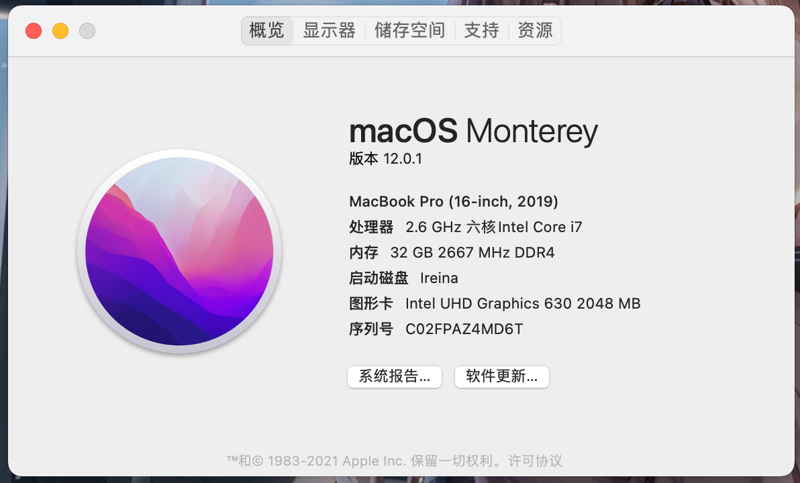

# GS65-9SD-Hackintosh

基于 `OpenCore 0.7.6`，已在 `Monterey` 上测试通过

使用前，请自己重新生成三码

## 驱动列表

- 有线网络 正常
- wifi & 蓝牙 正常
- Thunderbolt 3 正常
- 键盘触摸板 正常
- 声音 正常

## BIOS 设置

- 关闭 `VT-d`
- 关闭 `CFG`
- 关闭 `Secure Boot` & `Fast Boot`

## 已知问题

- 由于未知问题，通过雷电口外接的显示屏在 `4K@60` 下会黑屏，使用 `SwitchResX` 添加 `4K@50` 可有较好的体验

